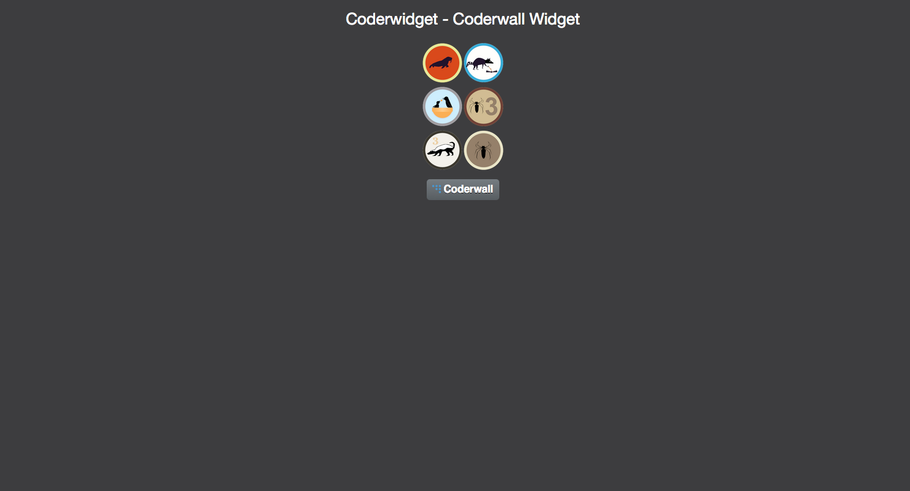

# Coderwidget
> Coderwall Widget developed with Vanilla JS



## Demo
View demo [here](http://www.pinceladasdaweb.com.br/blog/uploads/coderwidget/).

## Getting Started

```bash
# Get the latest snapshot
$ git clone https://github.com/pinceladasdaweb/Awesomstar.git
```

The script depends on the following HTML markup:

```html
<div class="coderwidget"></div>
```

Add the following CSS to the HEAD section of your page:

```html
<link rel="stylesheet" href="path/to/coderwidget.min.css">
```

Add the following javascript after your coderwidget container:

```html
<script src="path/to/coderwidget.min.js"></script>
<script>
    Coderwidget.init({
        user: 'your_coderwall_username',
        orientation: 'horizontal'
    });
</script>
```

The script expect the following values:

| Value                              | Description                                                 |
| ---------------------------------- |:-----------------------------------------------------------:|
| **user**                           | The Coderwall username.                                     |
| **orientation**                    | vertical or horizontal. vertical is default.                |

## Browser support

 |  |  |  | 
--- | --- | --- | --- | --- |
IE 8+ ✔ | Latest ✔ | Latest ✔ | Latest ✔ | Latest ✔ |

## Contributing

Check [CONTRIBUTING.md](CONTRIBUTING.md) for more information.

## History

Check [Releases](https://github.com/pinceladasdaweb/Coderwidget/releases) for detailed changelog.

## License

[MIT](LICENSE)